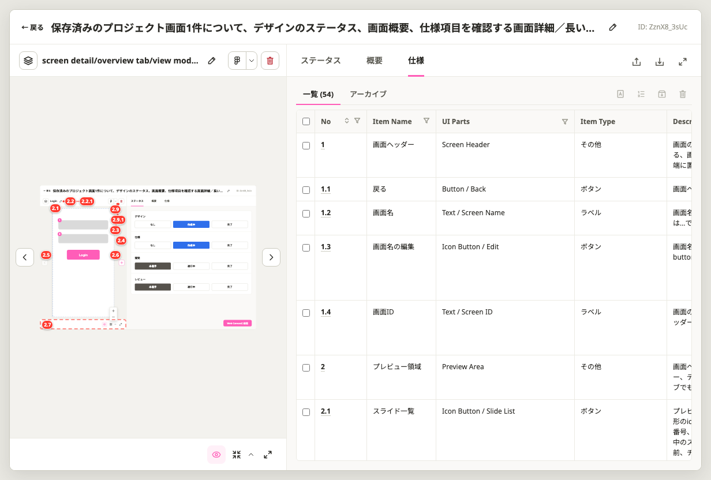

# Claude Code Skills for Screen Specifications

Three Claude Code skills that write screen specifications in two ways:

- **On your own Excel template.** The spec is an Excel file in your folder, which you open in
  Excel or upload to Google Sheets. A numbered screen image goes with it.
- **On the MoMorph template.** The spec is stored in the MoMorph database, on the CSV template of
  your MoMorph project.

| Skill | Writes | Template | Saved to |
| --- | --- | --- | --- |
| [`screen-detail-spec-excel`](screen-detail-spec-excel/SKILL.md) | A screen detail design document (画面詳細設計書) in Japanese: metadata, item definitions, rules, states, errors, messages and open questions | Your Excel template; a reference template is bundled | An `.xlsx` file in your folder |
| [`numbered-image-skill`](numbered-image-skill/SKILL.md) | A screen image with a number on every component, from a Figma frame or a screenshot | None | A `.png` file in your folder |
| [`momorph-screen-spec-skill`](momorph-screen-spec-skill/SKILL.md) | The spec of one MoMorph screen, one row per component | The CSV template of your MoMorph project, downloaded from MoMorph | The MoMorph database, after your approval |

Both spec skills ask you each point their sources leave open before they write. The Excel spec refers to
each component by the number the image shows, so the two files are read side by side.

## Contents

- [1. Set up (once)](#1-set-up-once)
- [2. Write a spec on your Excel template](#2-write-a-spec-on-your-excel-template)
- [3. Add the numbered image to the Excel spec](#3-add-the-numbered-image-to-the-excel-spec)
- [4. Number a screen image on its own](#4-number-a-screen-image-on-its-own)
- [5. Write a spec on the MoMorph template](#5-write-a-spec-on-the-momorph-template)
- [6. Customise the Excel template and the numbering](#6-customise-the-excel-template-and-the-numbering)

## 1. Set up (once)

1. **Get the skills.** Clone this repository, then copy the folders you need into your Claude Code
   skills directory:
   ```sh
   cp -R skills/screen-detail-spec-excel skills/numbered-image-skill skills/momorph-screen-spec-skill ~/.claude/skills/
   ```
   To share them with one project's team only, copy them into that project's `.claude/skills/`
   instead.
2. **Check Python.** The Excel and image skills run small Python scripts. This command must print
   `ok`:
   ```sh
   python3 -c "import openpyxl, PIL; print('ok')"
   ```
   When it fails, install the missing package: `pip install openpyxl Pillow`.
3. **Connect Figma** (only when your screens are in Figma). Add the Figma MCP server to Claude Code
   and check that `/mcp` lists it as connected. A screenshot as the source needs no Figma access.
4. **Connect MoMorph** (only for `momorph-screen-spec-skill`). Add the MoMorph MCP server with your
   project's API key, and check that `/mcp` lists it as connected. Uploading a spec needs a key with
   write access.
5. **Restart Claude Code** so it loads the new skills.

## 2. Write a spec on your Excel template

> **The bundled template (`screen-detail-spec-excel/assets/screen-detail-spec-template.xlsx`) is a reference. Adapt its columns, tables and labels to your project before you write specs with it (section 6).**

**Prepare before you start**

- The screen: a Figma frame URL (right click the frame in Figma, Copy link to selection) or a
  screenshot file.
- Where your project keeps the material the spec rests on: requirements or feature spec, the data
  model (DB schema), the UI text file (i18n), and an approved spec to imitate, if you have one.
  Missing material is fine; Claude asks instead of guessing.
- A folder for the output.

**Steps**

1. **Ask Claude Code**, for example:
   > "Write the screen detail spec in Excel for this Figma frame" `https://www.figma.com/design/...?node-id=...`

   or, with a screenshot:
   > "Write the screen detail spec in Excel for this screen" `path/to/screen.png`
2. **Answer the scope questions.** Claude asks which states and overlays belong to this document,
   where to save the files, and which language the UI text is written in.
3. **Point Claude to your sources.** Tell it where the requirements, data model and UI text live,
   or say which ones do not exist. Claude reads them and records where every fact comes from.
4. **Answer the question round.** Before writing anything, Claude sends one list of numbered
   questions:
   - **Blocking**: points no source answers; the spec cannot be written without them.
   - **Conflict**: two sources disagree and their ranking does not settle it; choose which one wins.
   - **Default**: Claude proposes a value; accept it or correct it.

   Reply briefly, for example "Q1 a, Q2 b, Q3 to Q6 OK". A question you cannot answer yet can stay
   open: it goes to the Open questions table (未決事項) as Unanswered (未回答) instead of being
   guessed. If you tell Claude to decide by itself, it takes its recommended options and marks them
   in the Open questions table so a reviewer can see them.
5. **Receive two files** in the output folder:
   - The spec, named screen detail design document, screen name and date
     (`画面詳細設計書_<画面名>_<YYYYMMDD>.xlsx`).
   - The numbered screen image, named screen detail design document, screen name and numbered
     image (`画面詳細設計書_<画面名>_番号付き画像.png`).

   Claude also reports the defaults it took, the questions still open, the conflicts between
   sources and how each was settled, and any content the template had no place for.
6. **Put the numbered image into the spec.** See section 3.
7. **Review the spec.**
   - Check the Open questions table (未決事項) first: every row marked Unanswered (未回答) still
     needs a decision.
   - Check that every number in the image has a row in the Item definitions table (項目定義).
   - Fill the Review date (レビュー日) and the reviewer's name in row 4, and set the Status
     (ステータス) to Confirmed (確定) once the spec is approved.
8. **Update the spec later.** Ask Claude to update the spec with what changed. It asks again about
   anything the change leaves open, and adds a row to the Revision history sheet (改訂履歴).

## 3. Add the numbered image to the Excel spec

The left column of the Screen detail design sheet (画面詳細設計) is the image area: column B, from
row 7, marked "Paste the numbered screen image" (番号付き画面画像を貼り付ける). It is about 600 px
wide.

**Microsoft Excel (Windows or Mac)**

1. Open the spec file and go to the Screen detail design sheet (画面詳細設計).
2. Click cell **B7**.
3. Insert the PNG: Windows, **Insert > Pictures > This Device**; Mac, **Insert > Pictures > Picture
   from File**. Choose the numbered screen image.
4. The picture lands with its top left corner on B7. If it is wider than column B, drag a corner
   handle while holding **Shift** until its width matches the column. Shift keeps the proportions,
   so the numbers stay readable.
5. Right click the picture, **Format Picture > Size & Properties > Properties**, and choose **Move
   but don't size with cells**. Row heights then never stretch the image.
6. Save the file.

A tall screen extends below row 47: that is expected, the area below column B stays empty.

**Google Sheets**

1. Upload the Excel file to Google Drive and open it with Google Sheets.
2. Click cell **B7**, then **Insert > Image > Image over cells**, and upload the PNG.
3. Drag a corner to fit the width of column B, then download the file as `.xlsx` if you need Excel.

## 4. Number a screen image on its own

The image skill also works without the spec, for example to annotate a design for a review.

**Example prompt**


| No | Part of the prompt | What to write | Required |
| --- | --- | --- | --- |
| 1 | The request | What Claude must do: number the components of the screen | Yes |
| 2 | The target | The Figma frame link, with its `node-id`. In Figma, right click the frame, then Copy link to selection. A screenshot path works too | Yes |
| 3 | Conditions | How the numbers look: their size, and where they go when components are crowded. Leave it out to use the skill's rules: sized to the screen's normal text within bounds set by the image size, beside each component, in the margins only when there is no room | No |
| 4 | Output | Where to save the PNG. Leave it out and Claude asks | No |

**Steps**

1. Ask Claude Code as in the example above.
2. Claude reads the frame from Figma, puts a number on every component, and saves the PNG.
3. Claude checks the result and tells you about any number that could not stay next to its
   component.

When you number several images of the same screen in one session (its states), each component gets
its number once, on the first image that shows it.

**Example result**

The Screen List of MoMorph, numbered by the skill. Its rows are close together, so the numbers sit
in the left and right margins, each with a line to its component. A container (dashed frame) gets
the number of the group, its parts get `n.m`.


## 5. Write a spec on the MoMorph template

**Prepare before you start**

- The screen's 10 character screen ID (shown on the MoMorph Figma plugin's screen panel), or the
  link to its Figma frame. The screen must already exist in MoMorph and be synced from the plugin.
- A folder for the output.

**Steps**

1. **Ask Claude Code, naming MoMorph**, for example:
   > "Write the MoMorph spec for screen `ABCDE12345` and save it in `specs/`"

   A request that does not name MoMorph does not start this skill.
2. **Claude downloads the screen's spec CSV from MoMorph** and saves it as the baseline. A screen
   with no spec yet returns the header only, which is your project's template. Claude writes on
   exactly those columns.
3. **Answer Claude's questions.** Every cell the design and the baseline do not answer comes back
   as one list of questions, each with the item number, the column and the options seen.
4. **Review the file.** Claude tells you the file path and the rows added, changed and archived.
5. **Approve the upload.** Claude uploads only after you say so, then downloads the spec again to
   verify it.

**Example result**

A screen's spec in MoMorph. The Specs tab lists one row per item, with its number, name,
linked layer (UI Parts) and type; the preview on the left carries the same numbers on the design.



## 6. Customise the Excel template and the numbering

- **Template columns and tables:** list the Item definitions (項目定義) columns (add, remove,
  rename, width) and the blank row count of each table in a `layout.json`, then rebuild the
  template. Its keys are in the header of `build_template.py`:
  ```sh
  python3 screen-detail-spec-excel/scripts/build_template.py screen-detail-spec-excel/assets/screen-detail-spec-template.xlsx layout.json
  ```
  `fill_spec.py` lists under `skipped` any content the template has no place for.
- **Filling the template without Claude:** write the content as JSON in the format of
  `screen-detail-spec-excel/references/content-format.md`, then run
  `python3 screen-detail-spec-excel/scripts/fill_spec.py <template.xlsx> <content.json> <out.xlsx>`.
- **Number size and placement:** the badge follows the screen's body text size, kept between 1.8%
  and 4.5% of the image's longer edge. Change those bounds per image with `"badge_range"` in the
  config; the other constants sit at the top of `numbered-image-skill/render_badges.py`,
  documented in `numbered-image-skill/references/renderer.md`.
