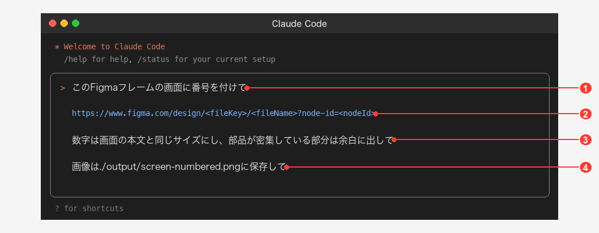
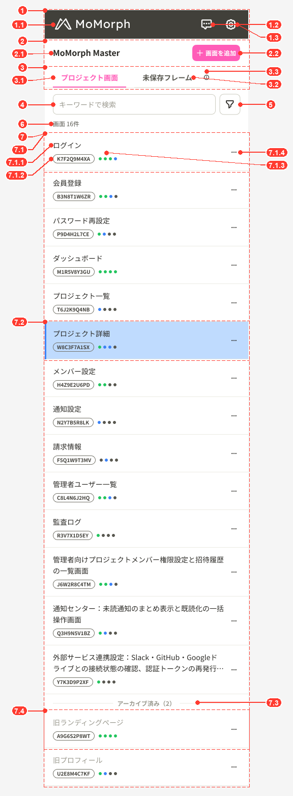

# Screen spec skills for Claude Code

Two Claude Code skills that write a screen specification together:

| Skill | Produces |
| --- | --- |
| [`screen-detail-spec-excel`](screen-detail-spec-excel/SKILL.md) | A Japanese screen detail design document (画面詳細設計書) as Excel: metadata, item definitions, rules, states, errors, messages and open questions, from a fixed template. It asks you every point the sources leave open before it writes |
| [`numbered-image-skill`](numbered-image-skill/SKILL.md) | A PNG of the screen with a number on every component, from a Figma frame or a screenshot |

The Excel spec refers to each component by the number the image shows, so the two files are read
side by side.

## 1. Set up (once)

1. **Get the skills.** Clone this repository, then copy both folders into your Claude Code skills
   directory:
   ```sh
   cp -R skills/screen-detail-spec-excel skills/numbered-image-skill ~/.claude/skills/
   ```
   To share them with one project's team only, copy them into that project's `.claude/skills/`
   instead.
2. **Check Python.** Both skills run small Python scripts. This command must print `ok`:
   ```sh
   python3 -c "import openpyxl, PIL; print('ok')"
   ```
   When it fails, install the missing package: `pip install openpyxl Pillow`.
3. **Connect Figma** (only when your screens are in Figma). Add the Figma MCP server to Claude Code
   and check that `/mcp` lists it as connected. A screenshot as the source needs no Figma access.
4. **Restart Claude Code** so it loads the new skills.

## 2. Write a screen spec, step by step

> **The template bundled with this skill (`screen-detail-spec-excel/assets/screen-detail-spec-template.xlsx`) is a reference. Adjust its columns, tables and labels to your project's requirements before you write specs with it (see section 5).**

**Prepare before you start**

- The screen: a Figma frame URL (right click the frame in Figma, Copy link to selection) or a
  screenshot file.
- Where your project keeps the material the spec rests on: requirements or feature spec, the data
  model (DB schema), the UI text file (i18n), and an approved spec to imitate, if you have one.
  Missing material is fine; Claude asks instead of guessing.
- A folder for the output.

**Steps**

1. **Ask Claude Code**, for example:
   > 「このFigmaフレームの画面詳細設計書を作成して」 `https://www.figma.com/design/...?node-id=...`

   or, with a screenshot:
   > "Viết 画面詳細設計書 cho màn này" `path/to/screen.png`
2. **Answer the scope questions.** Claude asks which states and overlays belong to this document,
   where to save the files, and which language the UI text is written in.
3. **Point Claude to your sources.** Tell it where the requirements, data model and UI text live,
   or say which ones do not exist. Claude reads them and records where every fact comes from.
4. **Answer the question round.** Before writing anything, Claude sends one list of numbered
   questions:
   - **Blocking**: points no source answers; the spec cannot be written without them.
   - **Conflict**: two sources disagree; choose which one wins.
   - **Default**: Claude proposes a value; accept it or correct it.

   Reply briefly, for example "Q1 a, Q2 b, Q3 to Q6 OK". A question you cannot answer yet can stay
   open: it goes to the 未決事項 table as 未回答 instead of being guessed. If you tell Claude to decide
   by itself, it takes its recommended options and marks them in 未決事項 so a reviewer can see them.
5. **Receive two files** in the output folder:
   - `画面詳細設計書_<画面名>_<YYYYMMDD>.xlsx`: the spec.
   - `画面詳細設計書_<画面名>_番号付き画像.png`: the numbered screen image.

   Claude also reports the defaults it took, the questions still open, and every conflict between
   the design and other sources.
6. **Put the numbered image into the spec.** See section 3.
7. **Review the spec.**
   - Check the 未決事項 table first: every row marked 未回答 still needs a decision.
   - Check that every number in the image has a row in 項目定義.
   - Fill レビュー日 and the reviewer's name in row 4, and set ステータス to 確定 once the spec is
     approved.
8. **Update the spec later.** Ask Claude to update the spec with what changed. It asks again about
   anything the change leaves open, and adds a row to the 改訂履歴 sheet.

## 3. Put the numbered image into the Excel spec

The left column of the 画面詳細設計 sheet is the image area: column B, from row 7, marked
「番号付き画面画像を貼り付ける」. It is about 600 px wide.

**Microsoft Excel (Windows or Mac)**

1. Open `画面詳細設計書_<画面名>_<YYYYMMDD>.xlsx` and go to the 画面詳細設計 sheet.
2. Click cell **B7**.
3. Insert the PNG: Windows, **Insert > Pictures > This Device**; Mac, **Insert > Pictures > Picture
   from File**. Choose `画面詳細設計書_<画面名>_番号付き画像.png`.
4. The picture lands with its top left corner on B7. If it is wider than column B, drag a corner
   handle while holding **Shift** until its width matches the column. Shift keeps the proportions,
   so the numbers stay readable.
5. Right click the picture, **Format Picture > Size & Properties > Properties**, and choose **Move
   but don't size with cells**. Row heights then never stretch the image.
6. Save the file.

A tall screen extends below row 47: that is expected, the area below column B stays empty.

**Google Sheets**

1. Upload the Excel file to Google Drive and open it with Google Sheets.
2. Click cell **B7**, then **Insert > Image > Image over cells**, and upload the PNG.
3. Drag a corner to fit the width of column B, then download the file as `.xlsx` if you need Excel.

## 4. Number a screen image on its own

The image skill also works without the spec, for example to annotate a design for a review.

**Example prompt**



| No | Part of the prompt | What to write | Required |
| --- | --- | --- | --- |
| 1 | The request | What Claude must do: number the components of the screen | Yes |
| 2 | The target | The Figma frame link, with its `node-id`. In Figma, right click the frame, then Copy link to selection. A screenshot path works too | Yes |
| 3 | Conditions | How the numbers look: their size, and where they go when components are crowded. Leave it out to use the skill's rules: the size of the screen's normal text, beside each component, in the margins only when there is no room | No |
| 4 | Output | Where to save the PNG. Leave it out and Claude asks | No |

**Steps**

1. Ask Claude Code as in the example above.
2. Claude reads the frame from Figma, puts a number on every component, and saves the PNG.
3. Claude checks the result and tells you about any number that could not stay next to its
   component.

**Example result**

The Screen List of MoMorph, numbered by the skill. Its rows are close together, so the numbers sit
in the left and right margins, each with a line to its component. A container (dashed frame) gets
the number of the group, its parts get `n.m`.



## 5. Customise

- **Template columns and tables:** edit the column lists in
  `screen-detail-spec-excel/scripts/build_template.py`, then rebuild the template:
  ```sh
  python3 screen-detail-spec-excel/scripts/build_template.py screen-detail-spec-excel/assets/screen-detail-spec-template.xlsx
  ```
- **Filling the template without Claude:** write the content as JSON in the format of
  `screen-detail-spec-excel/references/content-format.md`, then run
  `python3 screen-detail-spec-excel/scripts/fill_spec.py <template.xlsx> <content.json> <out.xlsx>`.
- **Number size and placement:** constants at the top of `numbered-image-skill/render_badges.py`,
  documented in `numbered-image-skill/references/renderer.md`.
